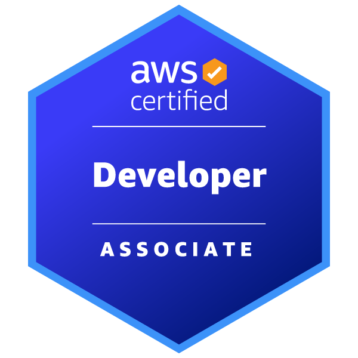

# Bruno Oliveira 

  
  

 

<h1 align="center">📂 Portfólio & Currículo</h1>

  <a href="https://www.bruno-oliveira-portfolio.com.br/" target="_blank">
    
  </a>
  <a href="https://curriculo-bruno-oliveira-s3-aws.s3.us-east-1.amazonaws.com/Curriculo.pdf" target="_blank">
    
  </a>

## 🏆 Certificações

- **AWS Certified Solutions Architect - Associate** - [Ver credencial](https://www.credly.com/badges/7005d24f-fe32-4e87-a2f2-ab9181ebdf06/public_url)  
  

- **AWS Certified Cloud Practitioner** - [Ver credencial](https://www.credly.com/badges/3d703b37-f107-4b8a-8b5e-af9f703f50e7/public_url)  
  

- **AWS Certified Developer - Associate** - [Ver credencial](https://www.credly.com/badges/b58efc08-888e-4fd4-811b-a1487c7c4000)  
  

## 🛠️ Tecnologias

### Cloud & DevOps

### Banco de Dados

### Sistemas Operacionais & Versionamento

 

## 🚀 Projetos em Destaque

* **[Nome do Projeto 1]** - (Descrição: Projeto de IaC que provisiona um VPC e instâncias EC2 na AWS usando Terraform.)
* **[Nome do Projeto 2]** - (Descrição: Pipeline CI/CD que automatiza a construção e o deploy de uma aplicação web.)
* **[Nome do Projeto 3]** - (Descrição: Estudo de caso de migração de um ambiente on-premises para Azure Cloud.)

 

<h1 align="center">🌐 Redes Sociais</h1>

  <a href="mailto:brunoserrasilva@gmail.com">
    
  </a>
  <a href="https://www.linkedin.com/in/bruno-luiz-oliveira-" target="_blank">
    
  </a>
  <a href="https://medium.com/@brunooliveirasilva" target="_blank">
    
  </a>

